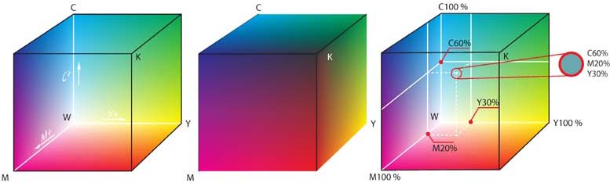
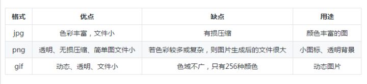

# 解释概念  
**1.ASCII**  

ASCII（发音： /ˈæski/ ass-kee，American Standard Code for Information Interchange，美国信息交换标准代码）是基于拉丁字母的一套计算机编码系统。它主要用于显示现代英语，而其扩展版本EASCII则可以部分支持其他西欧语言，并等同于国际标准ISO/IEC 646。

ASCII第一次以规范标准的类型发表是在1967年，最后一次更新则是在1986年，至今为止共定义了128个字符；其中33个字符无法显示（一些终端提供了扩展，使得这些字符可显示为诸如笑脸、扑克牌花式等8-bit符号），且这33个字符多数都已是陈废的控制字符。控制字符的用途主要是用来操控已经处理过的文字。在33个字符之外的是95个可显示的字符。用键盘敲下空白键所产生的空白字符也算1个可显示字符（显示为空白）。 

*缺点*  
ASCII的局限在于只能显示26个基本拉丁字母、阿拉伯数目字和英式标点符号，因此只能用于显示现代美国英语（而且在处理英语当中，即使会违反拼写规则，外来词如naïve、café、élite等等时，所有重音符号都必须去掉）。虽然EASCII解决了部分西欧语言的显示问题，但对更多其他语言依然无能为力。因此，现在的软件系统大多采用Unicode。  

**2.颜色**  

颜色或色彩是通过眼、脑和我们的生活经验所产生的一种对光的视觉效应。人对颜色的感觉不仅仅由光的物理性质所决定，还包含心理等许多因素，比如人类对颜色的感觉往往受到周围颜色的影响。有时人们也将物质产生不同颜色的物理特性直接称为颜色。 

*红绿蓝三原色 (RGB)*  

RGB色彩立方体  

发光的媒体（比如电视机）使用红、绿 和蓝加色的三元色，每种光尽可能只刺激针对它们的锥状细胞而不刺激其它的锥状细胞。这个系统的色域占人可以感受到的色彩空间的大部分，因此电视机和电脑萤幕使用这个系统。

理论上我们也可以使用其他颜色作为元色，但使用红、绿和蓝我们可以最大地达到人的色彩空间。遗憾的是对于红、绿和蓝色没有固定的波长的定义，因此不同的技术仪器可能使用不同的波长从而在萤幕上产生稍微不同的颜色。

青、洋红、黄、黑四元色 (CMYK)

CMYK色彩立方体  

理论上，青色、洋红色和黄色半透明的颜料涂在白色的底上，颜料会结合而吸收所有光线，然后产生黑色。然而实际上会产生很暗的棕色。所以除了青色、洋红色和黄色之外，还会加入黑色以平衡色彩的偏差(即青、洋红、黄、黑CMYK)。

色相、饱和度和明度系统 (HSB)

在制作计算机图像时人们往往使用另一种颜色系统。这个颜色系统使用三项分类，分别叫做色相（hue）、饱和度（saturation）和明度（brightness）的系数。色调决定到底哪一种颜色被使用，饱和度决定颜色的纯度，亮度决定颜色的明暗程度。    

# 简单回答以下问题

1  A:  
ASCII 码：二进制：0100 0001	十进制：65	十六进制：0x41  
Unicode 码：  0x0041
utf-8 编码： 0x41

 中:  
ASCII 码：     
Unicode 码：  0x4e2d
utf-8 编码： D6D0 4E2D E4 B8 AD  

2 黄色：R：255，G：255，B：0

3 显示质量： Tiff>Png>Jpg  

相对于bmg的压缩率  
jpg：10:1到40:1
png：优点:无损压缩，有透明选项，压缩效率高于bmp  
缺点:一般体积比同尺寸的90%压缩率的jpg要大很多(通常是5倍以上),但人眼很难识别其中的区别   
tiff：TIFF文件可以是不压缩的，文件体积较大，也可以是压缩的，支持raw、rle、lzw、jpeg、 ccitt3组和4组等多种压缩方式。

