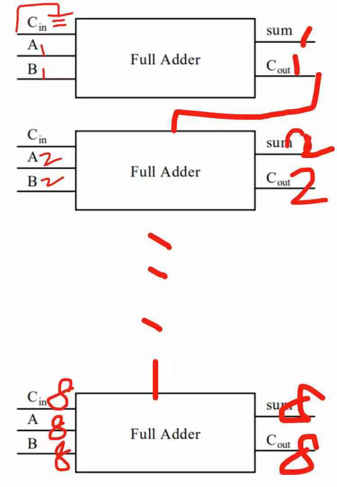

# Part 1
1.Give the three representations of an AND gate and say in your words what AND means.

1)布尔表达式:  
A·B  

2)符号：  

  
3)真值表:  

  

**The meaning of AND:**  
仅当输入的两个都是1时，输出1，否则输出0.  
仅当输入均为高电压时，输出才为高电压；若输入中至多有一个高电压时，则输出为低电压。  

2.Give the three representations of an XOR gate and say in your  words what XOR means

1)布尔表达式:  

2)符号：  

  
3)真值表:  

  

**The meaning of XOR:**  
输入不相同则输出为真，否则输出为假。  

3. Draw a circuit diagram corresponding to the following Boolean expression: (A + B)(B + C).

  

4.Show the behavior of the following circuit with a truth table:  

| A | B | output |
| ------| ------ | ------ |
|0|0|1|
|0|1|0|
|1|0|0|
|1|1|0|

5.What is circuit equivalence? Use truth table to prove the
following formula.  
(AB)’ = A’ + B’    

(AB)':  

|A|B|(AB)|(AB)'|
|------|------|------|------|
|0|0|0|1|
|1|0|0|1|
|0|1|0|1|
|1|1|1|0|  

A'+B':  

|A|B|A'|B'|A'+B|
|------|------|------|------|------|
|0|0|1|1|1|
|0|1|1|0|1|
|1|0|0|1|1|
|1|1|0|0|0|  

**因为(AB)'与A'+B'真值表相同，所以它们相等。**  

# Part 3

**1.Logic Gate**  

逻辑门是在集成电路上的基本组件。简单的逻辑门可由晶体管组成。这些晶体管的组合可以使代表两种信号的高低电平在通过它们之后产生高电平或者低电平的信号。高、低电平可以分别代表逻辑上的“真”与“假”或二进制当中的1和0，从而实现逻辑运算。常见的逻辑门包括“与”闸，“或”闸，“非”闸，“异或”闸（也称：互斥或）等等。

逻辑门是组成数字系统的基本结构，通常组合使用实现更为复杂的逻辑运算。一些厂商通过逻辑门的组合生产一些实用、小型、集成的产品，例如可编程逻辑器件等。  

**2.Boolean algebra**  

在数学和数理逻辑中，逻辑代数（有时也称开关代数、布尔代数）是变量的值仅为真和假两种真值（通常记作 1 和 0）的代数的子领域。初等代数中变量的值是数字，并且主要运算是加法和乘法，而逻辑代数的主要运算有合取与，记为∧；析取或 ，记为∨；否定非 ，记为¬ 。因此，它是以普通代数描述数字关系相同的方式来描述逻辑关系的形式主义。

逻辑代数是乔治·布尔（George Boole）在他的第一本书《逻辑的数学分析》（1847年）中引入的，并在他的《思想规律的研究》（1854年）中更充分的提出了逻辑代数。 根据Huntington“布尔代数”这个术语，最初是由Sheffer于1913年提出。

逻辑代数一直是数字电路设计的基础，并且所有现代编程语言提供支持。它也用在集合论和统计学中。  

**逻辑代数中的几个概念**  

参与逻辑运算的变量叫逻辑变量，用字母A，B……表示。每个变量的取值非0 即1。 0、1不表示数的大小，而是代表两种不同的逻辑状态。

正、负逻辑规定：

正逻辑体制规定：高电平为逻辑1，低电平为逻辑0。
负逻辑体制规定：低电平为逻辑1，高电平为逻辑0。
逻辑函数：如果有若干个逻辑变量（如A、B、C、D）按与、或、非三种基本运算组合在一起，得到一个表达式L。对逻辑变量的任意一组取值（如0000、0001、0010）L有唯一的值与之对应，则称L为逻辑函数。逻辑变量A、B、C、D的逻辑函数记为：L=f(A、B、C、D)

# Part 2
6)There are eight 1bit full adder integrated circuits. Combine them to 8bit adder
circuit using the following box diagram.  

7)Logical binary operations can be used to modify bit pattern.  

 Such as (X8X7X6X5X4X3X2X1)2 and (00001111)2 = (0000X4X3X2X1)2  

We called that (00001111)2 is a mask which only makes low 4 bits to work.  

Fill the follow expression

1.(X8X7X6X5X4X3X2X1)2 OR (00001111)2=(X8X7X6X51111)2

2.(X8X7X6X5X4X3X2X1)2 XOR (00001111)2=(X8X7X6X5not(X4X3X2X1))2

3.((X8X7X6X5X4X3X2X1)2 AND (11110000)2) OR (NOT(X8X7X6X5X4X3X2X1)2 AND (00001111)2)=(X8X7X6X5not(X4X3X2X1))2

# Flip-flop
1)中文翻译：  
中国大陆译作“触发器”、台湾及香港译作“正反器”。  

2)How many bits information does a SR latch store?  
一个锁存器可以储存**一比特**的资讯，通常会有多个一起出现，有些会有特别的名称，像是 “4位锁存器”（可以储存四个比特）或“8位锁存器”（可以储存八个比特）等等。
