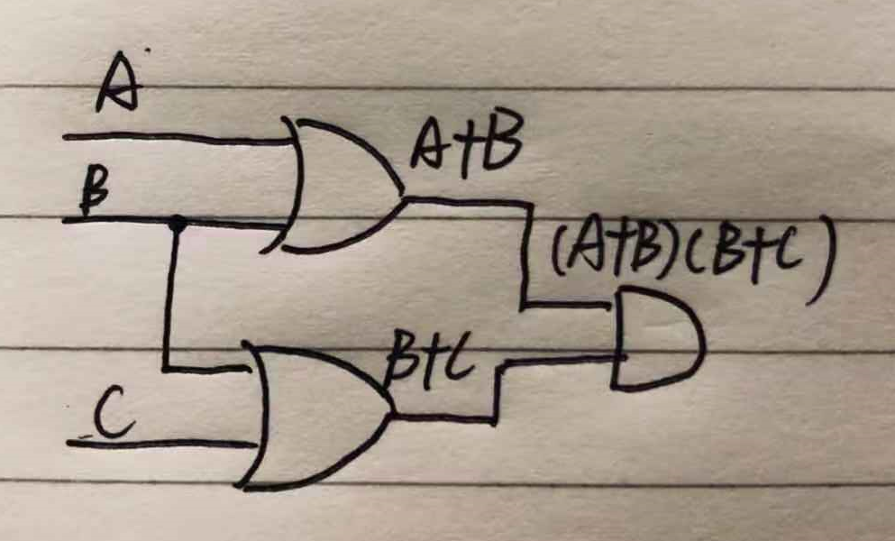

# Part 1
1.Give the three representations of an AND gate and say in your words what AND means.

1)布尔表达式:  
A·B  

2)符号：  

  
3)真值表:  

  

**The meaning of AND:**  
仅当输入的两个都是1时，输出1，否则输出0.  
仅当输入均为高电压时，输出才为高电压；若输入中至多有一个高电压时，则输出为低电压。  

2.Give the three representations of an XOR gate and say in your  words what XOR means

1)布尔表达式:  

2)符号：  

  
3)真值表:  

  

**The meaning of AND:**  
输入不相同则输出为真，否则输出为假。  

3. Draw a circuit diagram corresponding to the following Boolean expression: (A + B)(B + C).

  

4.Show the behavior of the following circuit with a truth table:  

| A | B | output |
| ------| ------ | ------ |
|0|0|1|
|0|1|0|
|1|0|0|
|1|1|0|

5.What is circuit equivalence? Use truth table to prove the
following formula.  
(AB)’ = A’ + B’    

(AB)':  

|A|B|(AB)|(AB)'|
|------|------|------|------|
|0|0|0|1|
|1|0|0|1|
|0|1|0|1|
|1|1|1|0|  

A'+B':  

|A|B|A'|B'|A'+B|
|------|------|------|------|------|
|0|0|1|1|1|
|0|1|1|0|1|
|1|0|0|1|1|
|1|1|0|0|0|  

**因为(AB)'与A'+B'真值表相同，所以它们相等。**  

