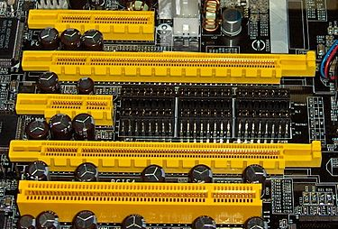

# Computer Components

## 1、According to the von Neumann architecture, List basic parts of a computer.    

**内存**(Memory)、  
**中央处理器**(CPU)（控制单元(Control Unit)&算术逻辑单元(Arithmetic Logic Unit）、  
**输入设备**(Input Device)、  
**输出设备**(Output Device)、  
**辅助存取设备**(Auxiliary Storage Device)

    

## 2、A computer has 64 MB (megabytes) of memory. How many bits are needed to address any single byte in memory?  

64 = 2^6  
64MB is 2^6 * 2^20 = 2^26  
This means you 26 bits are needed to address each byte.  

## 3、List basic parts of a CPU, include cache or not?  

运算器&控制器  
Arithmetic/Logic Unit & Control Unit  

包括。新型CPU集成了一些原先置于CPU之外的部件，如浮点处理器、高速缓存（Cache）等。
  
## 4、What mean secondary storage？ List some on your PC. 
硬盘、USB拇指驱动器、SD卡、光盘、DVD、磁带。
  

## 5.使用维基百科，解释以下概念：  
***CPU:***  
中央处理器 （英语：Central Processing Unit，缩写：CPU），是计算机的主要设备之一，功能主要是解释计算机指令以及处理计算机软件中的数据。计算机的可编程性主要是指对中央处理器的编程。1970年代以前，中央处理器由多个独立单元构成，后来发展出由集成电路制造的中央处理器，这些高度收缩的组件就是所谓的微处理器，其中分出的中央处理器最为复杂的电路可以做成单一微小功能强大的单元。

中央处理器广义上指一系列可以执行复杂的计算机程序的逻辑机器。这个空泛的定义很容易地将在“CPU”这个名称被普遍使用之前的早期计算机也包括在内。无论如何，至少从1960年代早期开始(Weik 1961)，这个名称及其缩写已开始在电子计算机产业中得到广泛应用。尽管与早期相比，“中央处理器”在物理形态、设计制造和具体任务的执行上有了极大的发展，但是其基本的操作原理一直没有改变。

早期的中央处理器通常是为大型及特定应用的计算机而定制。但是，这种昂贵的为特定应用定制CPU的方法很大程度上已经让位于开发便宜、标准化、适用于一个或多个目的的处理器类。这个标准化趋势始于由单个晶体管组成的大型机和微机年代，随着集成电路的出现而加速。IC使得更为复杂的中央处理器可以在很小的空间中设计和制造（在微米的数量级）。中央处理器的标准化和小型化都使得这一类数字设备和电子零件在现代生活中的出现频率远远超过有限应用专用的计算机。现代微处理器出现在包括从汽车到手机到儿童玩具在内的各种物品中。  

**Intel I7 CPU设备于主板上**  

  
  

***RAM:***  
随机存取存储器（英语：Random Access Memory，缩写：RAM），也叫主存，是与CPU直接交换数据的内部存储器。[1]它可以随时读写（刷新时除外，见下文），而且速度很快，通常作为操作系统或其他正在运行中的程序的临时数据存储介质。

主存（Main memory）即计算机内部最主要的存储器，用来加载各式各样的程序与数据以供CPU直接运行与运用。由于DRAM的性价比很高，且扩展性也不错，是现今一般计算机主存的最主要部分。2014年生产计算机所用的主存主要是DDR3 SDRAM，而2016年开始DDR4 SDRAM逐渐普及化，笔电厂商如华硕及宏碁开始在笔电以DDR4存储器取代DDR3L。  

**动态随机存取存储器（DRAM）的特点**
随机存取
所谓“随机存取”，指的是当存储器中的消息被读取或写入时，所需要的时间与这段信息所在的位置无关。

易失性
当电源关闭时RAM不能保留数据。如果需要保存数据，就必须把它们写入一个长期的存储设备中（例如硬盘）。RAM和ROM相比，两者的最大区别是RAM在断电以后保存在上面的数据会自动消失，而ROM则不会。

***ROM:***  
只读存储器（Read-Only Memory，ROM）是一种半导体存储器，其特性是一旦存储数据就无法再将之改变或删除，且内容不会因为电源关闭而消失。在电子或计算机系统中，通常用以存储不需经常变更的程序或数据，例如早期的家用计算机如Apple II的监督程序 [1]、BASIC语言解释器、与硬件点阵字体，个人计算机IBM PC/XT/AT的BIOS（基本输入输出系统）[2]与IBM PC/XT的BASIC解释器，与其他各种微计算机系统中的固件（Firmware），均存储在ROM内。  

  

***Bus(computing)***  

总线（Bus）是指计算机组件间规范化的交换数据（data）的方式，即以一种通用的方式为各组件提供数据传送和控制逻辑。从另一个角度来看，如果说主板（Mother Board）是一座城市，那么总线就像是城市里的公共汽车（bus），能按照固定行车路线，传输来回不停运作的比特（bit）。这些线路在同一时间内都仅能负责传输一个比特。因此，必须同时采用多条线路才能发送更多数据，而总线可同时传输的数据数就称为宽度（width），以比特为单位，总线宽度愈大，传输性能就愈佳。总线的带宽（即单位时间内可以传输的总数据数）为：总线带宽 = 频率×宽度（Bytes/sec）。  

种类
PC上一般有五种总线：

1. 数据总线（Data Bus）：在CPU与RAM之间来回传送需要处理或是需要储存的数据。
2. 地址总线（Address Bus）：用来指定在RAM（Random Access Memory）之中储存的数据的地址。
3. 控制总线（Control Bus）：将微处理器控制单元（Control Unit）的信号，传送到周边设备，一般常见的为USB Bus和1394 Bus。
4. 扩展总线（Expansion Bus）：可连接扩展槽和计算机。
5. 局部总线（Local Bus）：取代更高速数据传输的扩展总线。  

  
  

***Parallel Computing***    

并行计算（英语：parallel computing）一般是指许多指令得以同时进行的计算模式。在同时进行的前提下，可以将计算的过程分解成小部分，之后以并发方式来加以解决。

计算机软件可以被分成数个运算步骤来运行。为了解决某个特定问题，软件采用某个算法，以一连串指令运行来完成。传统上，这些指令都被送至单一的中央处理器，以循序方式运行完成。在这种处理方式下，单一时间中，只有单一指令被运行(processor level: 比较微处理器，CISC, 和RISC，即流水线Pipeline的概念，以及后来在Pipeline基础上以提高指令处理效率为目的的硬件及软件发展，比如branch-prediction, 比如forwarding，比如在每个运算单元前的指令堆栈，汇编程序员对programm code的顺序改写)。并行运算采用了多个运算单元，同时运行，以解决问题。  

## 6、写一段文字，简单解释“云计算（cloud computing）  

首先要说，云是什么？ 大量的水滴漂浮在空中，聚合成云。和我们所说的云也很相似，只是这里的云是由大量的数据存储、计算资源和应用程序组成，这便是云计算服务。   

第一次听到云计算服务，可能会有人感到很高深，其实不然，我们生活的周围处处都是云，网站在线浏览的视频，随时可以查看的邮箱和网盘等等，这些都是云服务。它就像我们日常生活中的水电煤气一样，已经变成了基础设施，任何人任何企业都可以通过网路接入云服务，从云那头获取源源不断的计算服务和应用程序等等。  

其次，为什么会出现云计算？ 打个比方吧，以前人们为了满足生活用水需要打一口井，而现在有了自来水就方便得多，打开水龙头就能随时使用（当然水费还是要交的~），现在的云计算服务就是“自来水”，我们不需要自己构建数据中心和服务器，只需要接入云便可以享受到云计算服务了（我，云计算，打钱）。2006年，Amazon Elastic Compute Cloud（亚马逊弹性云服务）横空出世，成为全世界最早的商用云计算服务，也是从这一刻开始，世界真正进入了云时代。  

云计算的未来？ 说到这里，便要提到一个东西，手机。手机的发展之快大家有目共睹，从较早的核桃终极者诺基亚到现在的智能曲面屏可谓是质的提升，未来将会是智能终端的时代，越来越方便的随身传感设备将会代替现在的网络，成为信息交流和新载体，正如谷歌执行董事说的：未来网络将会消失。那么云计算服务一个方向便是引导设备接入云，实现信息共享和交互，未来将会是云的江湖。  

## 7、小孙买了计算机主板，说明书表明“支持双通道DDR3-1333内存，最大支持16G”  
### 1）DDR3内存，“3”和“1333”的含义是什么？  
### 2）小孙买8G DDR3-1600的内存能提高性能吗？  
### 3）小孙买4G*2 DDR3-1333的内存能提高性能吗？  
### 4）16G需要多少位地址？

  

