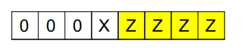
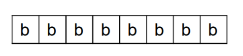

# Programming on Bare Machine

## 1、Program with machine language according to the following c.
### int_8 a = 1;
### int_8 c = a + 3;

### 1）Write your assembly code & machine code

### 2）Explain machine code execution with the fetch-decode-execute cycle  

### 3）Explain functions about IR, PC, ACC registers in a CPU  
**IR:**  
指令暂存器（Instruction register(IR)）在计算机科学中是中央处理器中控制单元用来储存执行中指令的暂存器。在简易的处理器中，每个将被执行的指令都会被存入指令暂存器中。从解码、准备到执行完成的过程中都会被持续的保存。

有些较为复杂的处理器使用管线化暂存器，其中管线上每个阶段只负责解码、准备或执行的其中一个，然后再传递至下一个阶段。现代的处理器甚至可以不用按照顺序做某些动作，也就是平行计算。

在指令暂存器中将运算代码解码的步骤包含确定指令、确定运算对象所在的内存位址、从内存中提取运算对象、分配处理器的资源来执行指令。

指令暂存器的输出可以用来控制执行指令时产生控制处理元件时间讯号的电路。

在指令周期中，指令在处理器从程式计数器取出其内存位址后才存入指令暂存器。  

**PC:**  
程序计数器（Program Counter (PC)）是一个处理器中的寄存器，用于指示计算机在其程序序列中的位置。它通常称为 Intel x86 和 Itanium 微处理器中的指令指针（IP），有时称为指令地址寄存器（IAR）、指令计数器或只是指令序列器的一部分。

在大部分的处理器，指令指针都是在提取程序指令后就被立即增加；也就是说跳跃指令的目的地址，是由跳跃指令的运算对象加上跳跃指令之后下一个指令的地址（比特或字节，视计算机形态而定）来获得目的地。

处理器通常从存储器中顺序获取指令，但控制传输指令通过在PC中添加一个新值来改变顺序。这些包括“分支”（有时称为“跳转”），“子例程调用”和“返回”。以某些断言的真实为条件的传输可让计算机在不同条件下遵循不同的顺序。

“分支”规定下一条指令从内存中的其他地方获取。“子程序”不仅调用分支，而且还保存 PC 的先前内容。“返回”检索 PC 的保存内容并将其放回去，然后按照子程序调用的指令继续顺序执行。  

**ACC:**  
在中央处理器中，累加器 (accumulator) 是一种寄存器，用来储存计算产生的中间结果。如果没有像累加器这样的寄存器，那么在每次计算 (加法，乘法，移位等等) 后就必须要把结果写回到 内存，也许马上就得读回来。然而存取主存的速度是比从算术逻辑单元到有直接路径的累加器存取更慢。

标准的例子就是把一列的数字加起来。一开始累加器设定为零，每个数字依序地被加到累加器中，当所有的数字都被加入后，结果才写回到主存中。

### 4）Explain physical meaning about vars a & c in a machine    

## 2、简答题
### 1）What are stored in memory?
暂时存放CPU中的运算数据，以及与硬盘等外部存储器交换的数据。  

### 2）Can a data or a instruction stored in the same place?
Yes.  

### 3） Explain Instruction Format with example instructions.  

指令由8位的指令说明符和8位的操作数说明符组成。  

**指令说明符**  
指令说明符说明要执行什么操作和如何解释操作数的位置。  

ZZZZ：操作码  
X:寻址模式    
1表示操作数是数值  
0表示操作数是该地址的内容  

**操作数说明符**  
操作数说明符存放操作数本身或者操作数地址。

  

## 3.解释名词  

### 1）汇编语言  

汇编语言（英语：assembly language）是一种用于电子计算机、微处理器、微控制器，或其他可编程器件的低级语言。在不同的设备中，汇编语言对应着不同的机器语言指令集。**一种汇编语言专用于某种计算机系统结构**，而不像许多高级语言，可以在不同系统平台之间移植。

使用汇编语言编写的源代码，然后通过相应的汇编程序将它们转换成可执行的机器代码。这一过程被称为汇编过程。

汇编语言使用助记符（Mnemonics）来代替和表示特定低级机器语言的操作。特定的汇编目标指令集可能会包括特定的操作数。许多汇编程序可以识别代表地址和常量的标签（Label）和符号（Symbols），这样就可以用字符来代表操作数而无需采取写死的方式。普遍地说，每一种特定的汇编语言和其特定的机器语言指令集是一一对应的。

许多汇编程序为程序开发、汇编控制、辅助调试提供了额外的支持机制。有的汇编语言编写工具经常会提供宏，它们也被称为宏汇编器。

现在汇编语言已不像其他大多数的程序设计语言一样被广泛用于程序设计，在今天的实际应用中，**它通常被应用在底层硬件操作和高要求的程序优化的场合。驱动程序、嵌入式操作系统和实时运行程序都会需要汇编语言。**  

### 2）编译  

编译(compilation , compile) 1、利用编译程序从源语言编写的源程序产生目标程序的过程。 2、用编译程序产生目标程序的动作。   

**编译就是把高级语言变成计算机可以识别的2进制语言，计算机只认识1和0，编译程序把人们熟悉的语言换成2进制的。**  

 编译程序把一个源程序翻译成目标程序的工作过程分为五个阶段：词法分析；语法分析；语义检查和中间代码生成；代码优化；目标代码生成。主要是进行词法分析和语法分析，又称为源程序分析，分析过程中发现有语法错误，给出提示信息。   

编译语言是一种以编译器来实现的编程语言。它不像直译语言一样，由解释器将代码一句一句运行，而是以编译器，先将代码编译为机器码，再加以运行。理论上，任何编程语言都可以是编译式，或直译式的。它们之间的区别，仅与程序的应用有关。  

### 3）命令性语言  

命令式编程（英语：Imperative programming），是一种描述计算机所需作出的行为的编程典范。几乎所有计算机的硬件工作都是命令式的；几乎所有计算机的硬件都是设计来运行机器代码，使用命令式的风格来写的。较高端的命令式编程语言使用变量和更复杂的语句，但仍依从相同的典范。菜谱和行动清单，虽非计算机程序，但与命令式编程有相似的风格：每步都是指令，有形的世界控制情况。因为命令式编程的基础观念，不但概念上比较熟悉，而且较容易具体表现于硬件，所以大部分的编程语言都是命令式的。

大部分的高级语言都支持四种基本的语句：

运算语句一般来说都表现了在存储器内的数据进行运算的行为，然后将结果存入存储器中以便日后使用。高端命令式编程语言更能处理复杂的表达式，可能会产生四则运算和函数计算的结合。
循环语句容许一些语句反复运行数次。循环可依据一个默认的数目来决定运行这些语句的次数；或反复运行它们，直至某些条件改变。
条件分支语句容许仅当某些条件成立时才运行某个区块。否则，这个区块中的语句会略去，然后按区块后的语句继续运行。
无条件分支语句容许运行顺序转移到程序的其他部分之中。包括跳跃（在很多语言中称为Goto）、副程序和Procedure等。
循环、条件分支和无条件分支都是控制流程。

早期的命令式编程语言都是计算机本身的机械语言。在这些语言中，指示非常简单，令硬件的运行更容易，却阻碍了复杂程序的设计。1954年开始开发的FORTRAN，是首个在复杂程序的设计中除掉机器代码的编程语言。它是编译型的编程语言，容许命名变量、复杂的表达式、副程序和其他功能，这些功能现在在命令式语言中都非常普遍。后来的二十年中，可以看到大量的其他高端命令式编程语言出现。在1980年后，面向对象编程有迅速的发展；面向对象编程语言均有着命令式的风格，但增添了支持对象的功能。  

### 4）函数式编程  

函数式编程（英语：functional programming）或称函数程序设计，又称泛函编程，是一种编程典范，它将计算机运算视为数学上的函数计算，并且避免使用程序状态以及易变对象。函数编程语言最重要的基础是λ演算（lambda calculus）。而且λ演算的函数可以接受函数当作输入（引数）和输出（传出值）。

比起指令式编程，函数式编程更加强调程序执行的结果而非执行的过程，倡导利用若干简单的执行单元让计算结果不断渐进，逐层推导复杂的运算，而不是设计一个复杂的执行过程。  

### 5） 过程式编程  

过程式程序设计（英语：Procedural programming），又称过程式编程、过程化编程，一种编程典范，有时会被视为是指令式编程的同义语。派生自结构化编程（Structured programming），主要采取程序调用（procedure call）或函数调用（function call）的方式来进行流程控制。流程则由包涵一系列运算步骤的程序（Procedures），例程（routines），子程序（subroutines）, 方法（methods），或函数（functions）来控制。在程序运行的任何一个时间点，都可以调用某个特定的程序。任何一个特定的程序，也能被任意一个程序或是它自己本身调用。

著名的例子有Linux内核，git，以及Apache HTTP Server等。