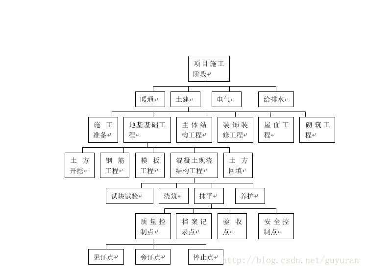

## 1、阅读 Pseudocode Standard。

### 1）用伪代码描述将十进制转换成16进制的方法 
SET 要转换的十进制数为X   
SET 计数器N为0  
FOR X大于0  
中间值=X%16  
IF 中间值>=10 THEN  
Y1=中间值-10+'A'  
ELSE THEN  
Y1=中间值
X=X/16  
计数器加一  
END FOR

FOR 计数器大于0  
PRINT Y(N)  
计数器减一  
END FOR

### 2）C语言实现（先用注释写好算法，然后翻译）  
```

/*将被转换的十进制数除以16的余数以十六进制形式依次存入一个数组，然后反向输出*/

#include <stdio.h>
int main()
{
	int num, temp;
	char a[10000];
	int cnt=0;
	scanf("%d", &num);
	
	for(cnt=0;num>0;cnt++)
	{
		temp=num%16;
		if(temp<10)
		{
			a[cnt]=temp+'0';
		}
		else
		{
			a[cnt]=temp-10+'A';
		}
		num/=16;
	}
	
	for(cnt-1;cnt>=0;cnt--)
	{
		printf("%c", a[cnt]);
	}
	
	return 0;
}

```
## 2、名词解释与对比  

### 1）Top-down design  
“自顶向下，逐步求精的方法”在英文中称作Top-down Design，是一种计算机编程使用的算法思想，顾名思义，这种方法的思想就是对现在遇到的复杂或者抽象化的问题，进行纵向深入分解并使其被分解为多个简单的、具体化的、可解决的问题。

自上而下的方法强调规划和对系统的完整理解。固有的是，在系统的至少某些部分的设计中达到足够的细节水平之前，不能开始编码。通过附加存根来代替模块来实现自上而下的方法。然而，这延迟了对系统的最终功能单元的测试，直到重要的设计完成。自下而上强调编码和早期测试，一旦指定了第一个模块就可以开始。然而，这种方法存在这样的风险：模块可能被编码而不清楚它们如何链接到系统的其他部分，并且这种链接可能不像最初想象的那么容易。代码的可重用性是自下而上方法的主要优点之一。  

自上而下是一种编程风格，是传统程序语言的主流，其中设计从指定复杂的部分开始，然后将它们分成连续的小部分。使用自上而下方法编写程序的技术是编写一个主程序，命名它将需要的所有主要功能。之后，编程团队会查看每个功能的要求，并重复该过程。这些划分的子程序最终将执行如此简单的动作，它们可以轻松简洁地编码。当所有各种子程序都被编码后，程序就可以进行测试了。通过定义应用程序如何在高层次上聚集在一起，较低级别的工作可以是自包含的。通过定义低级抽象如何被整合到更高级别的抽象中，

  

### 2） Work breakdown structure (WBS)  

在专案管理和系统工程中，工作分解结构〈英语：Work Breakdown Structure, WBS〉〈或称为承包商工作分解结构，英语：Contractor Work Breakdown Structure, CWBS〉系将一个专案细部分解为交付标的导向的较小组成。工作分解结构是关键的专案交付标的，可将专案团队工作组编成为可管理的部分。专案管理知识体系〈PMBOK第五版〉所定义的工作分解结构：“由专案团队实施整个专案工作范围的阶层化分解，以达成专案目标，并产出必要的交付标的”。

工作分解结构的基本元素，可为产品、资料、服务、或其组合，工作分解结构也为细部成本估算与管制提供了必要的框架，以及时程展开与管制的指引。  


### 3）简述管理学 WBS 与 信息学Top-down设计 的异同  

**同**：都始于全局，然后逐步向下细分成更小的单元  
**异**：WBS细分成更小的单元，即阶层化分解（横向切割）。Top-down为从上到下、从浅入深的分解（纵向分解），分解为多个简单、具体的问题。  


## 3、仔细观察您洗衣机的运作过程，运用Top-down设计方法和Pseudocode 描述洗衣机控制程序。假设洗衣机可执行的基本操作如下：

### 1）请使用伪代码分解“正常洗衣”程序的大步骤。包括注水、浸泡等。  

注水--水位达到需要的高度后停止注水--启动并开始计时、转动--到时后停止--排水--停机

### 2）进一步用基本操作、控制语句（IF、FOR、WHILE等）、变量与表达式，写出每个步骤的伪代码   

**注水：**  
water_in_switch(open） // open 打开上水开关，close关闭 

**水位达到需要的高度后停止注水：**  
SET terminal height to the value of the height to stop    
get_water_volume()   
IF get_water_volume() >= terminal height  //返回洗衣机内部水的高度
water_in_switch(close) 

**启动并开始计时、转动：**  
motor_run(direction) // 电机转动。left左转，right右转，stop停
time_counter() // 返回当前时间计数，以秒为单位  

**到时后停止：**   
motor_run(stop)  

**排水：**  
water_out_switch(open) // open 打开排水开关，close关闭
water_out_switch(close) // open 打开排水开关，close关闭  

**停机：**  
halt(returncode) //停机，success 成功 failure 失败 


### 3）根据你的实践，请分析“正常洗衣”与“快速洗衣”在用户目标和程序上的异同。    

**用户目标：**  
异：用户希望通过正常洗衣把衣服彻底洗净，通过快速洗衣快速得到洗干净并且甩干的衣服，从而节省时间。  
同：都要把衣服洗干净。  

**程序：**  
异:快速洗衣所转动所需的时间更短。  
同：都包含注水排水转动等步骤。

### 你认为是否存在改进（创新）空间，简单说明你的改进意见？  

快速洗衣可以增加甩干的功能。  


### 4）通过步骤3），提取一些共性功能模块（函数），简化“正常洗衣”程序，使程序变得更利于人类理解和修改维护。例如：  

wait(time) //等待指定的时间；  
注水(volume,timeout) //在指定时间内完成注水，否则停机；  
排水(timeout)。 等。  

烘干(time)  
浸泡时间(time)  
注水的高度(Height)
