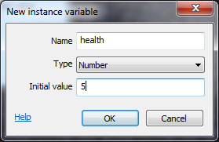

我:
--- 
# 如何使html5小游戏更具可玩性 

成品： 

---
**☑ 设置多个怪物**  

设置多个怪物，使游戏更具有挑战性，当然这不需要繁琐地多次双击添加，只需要ctrl+drag即可。 

 

**☑ 让怪物变得聪明** 

**1.让怪物向各个方向冲撞** 
怪物一开始时只是单纯的向右冲撞，让怪物学会“旋转跳跃”可以使游戏更具可玩性。 
具体操作： 
*Condition: System -> On start of Layout* 
*Action: Monster -> Set angle -> random(360)* 

**2.让怪物拥有智能，让它们“学会”自己向玩家冲去** 
怪物离开布局后，将无法再在屏幕上看到它们。使它们留在布局中并在离开布局时永远指向玩家。 
具体操作： 
*Condition: Monster -> Is outside layout* 
*Action: Monster -> Set angle toward position -> For X, Player.X - for Y, Player.Y.* 

**☑ 增加怪物血量** 

若怪物一被射中就立刻死亡，就太没挑战性了，给怪物增加一定的血条，让游戏更有意思一点。 

用实例变量，建造一个“血量”计数器，让怪物们记住自己的血量，被击中五次后，血槽空了，怪物死亡。

具体操作： 

1.点击增加变量 

 

2.添加实例变量，type改为number，将initial value改为5。（即总血量为5，击中一次血量-1，血量掉为0后怪物被destroy） 

3.让子弹每次击中怪物后，health减去1。 
点击 bullet- on collision with Monster，将 "destroy monster" 替换为 "subtract 1 from health"。

 

4.点击 Monster - > Subtract from（在Instance variables category中）- > Instance变量“health”，并为Value输入1。 

于是现在我们每射中一次怪物，它的血量就会-1，但我们要想杀死怪物，则需要： 
*Condition: Monster -> Compare instance variable -> Health, Less or equal, 0* 
*Action: Monster -> Spawn another object -> Explosion, layer 1* 
*Action: Monster -> Destroy* 

（设置<=5的原因：可能会有更强大的武器有血量-2、-3的作用，这时血量直接掉到负数也会导致死亡）

**☑ 显示得分**

玩家每杀死一只怪物得1分，可视化的分数可以使玩家看到自己玩的有多好，增加趣味性。

具体操作：

1.添加全局变量 

 

在“Monster：health less or equal 0”事件中，单击Add action，然后选择System - > Add to - > Score，value 1。 

让我们用文本对象向玩家展示分数：

1.创建HUD（也称为平视显示器，是显示玩家在游戏中的健康，得分和其他信息的界面。） 即：添加新图层置于最上层，命名为HUD。

2.插入text对象，用播放器的分数更新文本。即：在我们之前添加的Every tick事件中，添加操作Text - 
我:
2.插入text对象，用播放器的分数更新文本。即：在我们之前添加的Every tick事件中，添加操作Text - > Set text。输入 "Score:"&Score。

**☑让怪兽产卵**

让怪兽不断“产卵”，否则一旦把布局内所有怪兽射杀完便无事可做了。

具体操作： 
*Condition: System -> Every X seconds -> 3* 
*Action: System -> Create object -> Monster, layer 1, 1400 (for X), random(1024) (for Y)*

1400是紧邻布局右边缘的X坐标，随机（1024）是随机Y坐标布局的高度。

最后，让鬼魂杀死玩家。 
*condition: Monster -> On collision with another object -> Player* 
*Action: Player -> Destroy*