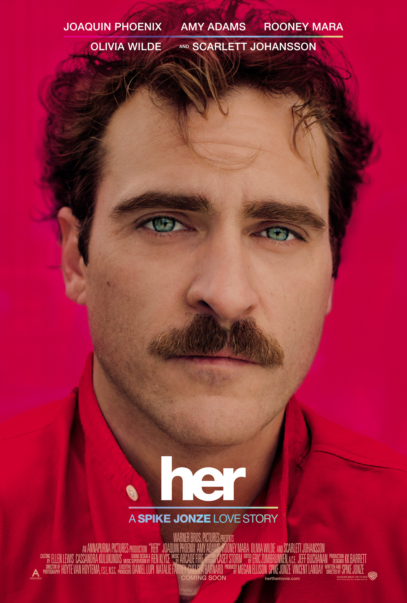
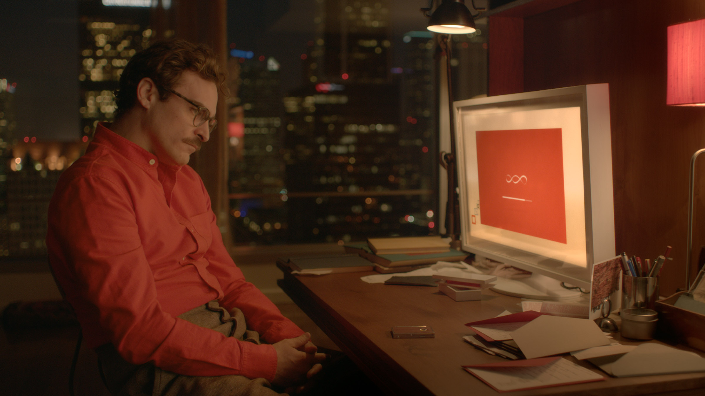
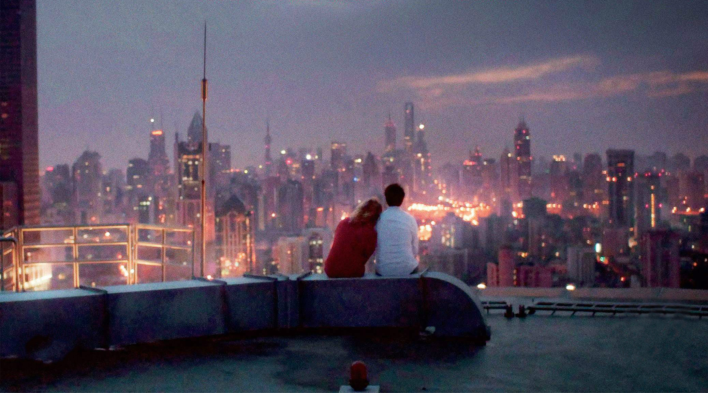

# 人与AI的爱情——电影《Her》

**日新月异的科技改变着我们的生活，也逐渐把人孤立成一座岛屿。**

   
   

片中的男主人公西奥多虽然替客户书写富有感情的信件，但下班之后，他就变成一个无情的机器，回到寂寞空虚的公寓进入人机对话的“社交”生活（游戏、虚拟世界）中。  
    
尽管是一个虚构的未来背景，却这部电影和当下的网络时代相契合。指尖运动替代了传统的语言文字，在网络进化的过程中，人类的沟通却是退化的。这也是为什么现在很多咖啡厅或餐厅，鼓励让大家收起手机，享受和朋友聊天的乐趣。片中的人工智能语音系统，看似抽象或无形，却在潜移默化中引出了人机对话的进化论，如果电脑、手机将来真可以模拟人类的情感，那么两者的关系将何去何从？        
  
片中的男主角西奥多正要从离婚的阴影中走出来，就遇到了语音系统萨曼莎。萨曼莎聪慧、风趣、敏感、带有自嘲精神并愿意为主人做任何事。从该意义上讲，她是完美的。与人类一样，她也在无形中成长——无论是知识的进步、情感的养成，还是在感情上的投入，都是如此真实。她想看的更多、了解的更多，于是变得愈加依赖于他。  
  
由于西奥多的撰信工作，他擅长组织“语言”，而萨曼莎则乐于倾诉“感觉”，两者无形间构筑了一种柏拉图式的精神恋爱。当西奥多与相亲对象的约会以失败告终后，他与萨曼莎进行了“一夜交欢”，想象力已然超越了生理需求。然而，这终归是一种精神需求，他不一定爱她，只是一种表达方式，可她爱上了他（只是没有表露），当她找来充当肉身的性伴侣来作为灵与肉的合二为一，他感到了不适，并慢慢地从这种关系中撤退。  

在西奥多与前妻凯瑟琳的婚姻刚走到尽头时，他很快就进入了萨曼莎的世界。因为萨曼莎总是乐于接受、有同情心，并总在尝试帮助他。也许凯瑟琳说得对，西奥多连真人的情感都应付不来，只是需要一个对任何实质性问题都毫无烦恼的“妻子”。在与凯瑟琳的对话中，我们能够看到，她显然还是爱他或者说是对他留有余地的（不要求他及早在离婚协议书上签字），他应该能够挽回婚姻，但他没有这么做，因为他已经投入了与萨曼莎的精神恋爱（而凯瑟琳失望极了）。
　　

另一方面，随着萨曼莎的敏感，她对自己不断进化的意识产生了质疑。在西奥多与同事野餐一幕最有体现，尽管萨曼莎受制于物理限制，但思想是自由的，心灵可以穿梭于各地。而人类的肉体终将消亡，以至于西奥多和同事无言应对。这也对应了影片结局，语音系统虽然消失，留下西奥多继续苟延残喘。换位思考下，如果萨曼莎陪伴西奥多走完一生，后者肉体消亡，前者也将会孤独面对之后的日子。二者注定不会永远走到一起，只能说是她用音乐拍摄的照片，他来填词的二度爆光，可以将二者定格为“永恒”。

导演斯派克·琼斯将影片赋予了一种全新的风格，一种可信的未来主义（这个软科幻的外观和感觉，电影在有意识的经营。包括一直采用温暖的光晕和日落，来传达完美的浪漫情调。以及用上海的外景来拍出未来的洛杉矶外景（如果对比一下我们不难发现，《她》和斯派克.琼斯前妻索菲亚.科波拉的《迷失东京》有很多相似的镜头，并且女主角都是斯嘉丽.约翰逊，可视作对前妻的回应之作，来上海取景的异国情调也有了更明确的定义），以营造出导演想要的摩天大厦、过街天桥和宽敞空间相得益彰的未来世界。配色方面，多采用红色和黄色等温暖柔和的色调，几乎没有一丝蓝色（冷色调）。

《她》并不是一部完美无瑕的电影，但是西奥多与萨曼莎的甜蜜、伤感，令人深思，很大程度上得益于杰昆·菲尼克斯的表现，朴实细腻、极具亲和力；而斯嘉丽·约翰逊用声音诠释的萨曼莎既真实又温柔、磁性又亲密，让人几乎忘却她是一个语音系统，认为她就是一个活生生的人。《她》不只是剧作和表演精彩，导演的工作特性让影片时刻拥有视听享受，又能保有哲思的话题，实在难得。