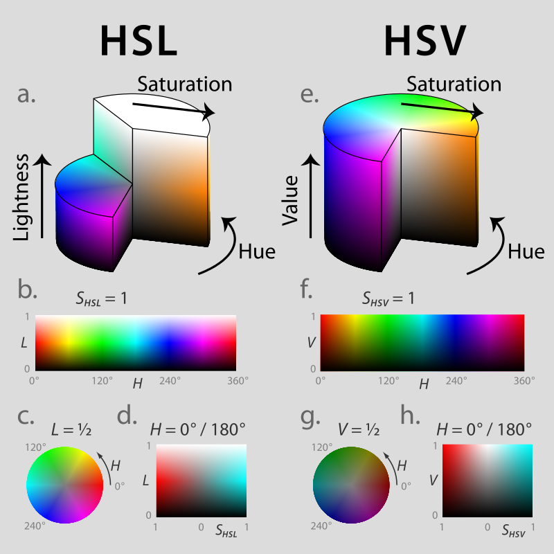

# 色彩编码

# 颜色
什么是颜色？ 

颜色或色彩是通过眼、脑和我们的生活经验所产生的一种对光的视觉效应。人对颜色的感觉不仅仅由光的物理性质所决定，还包含心理等许多因素，比如人类对颜色的感觉往往受到周围颜色的影响。有时人们也将物质产生不同颜色的物理特性直接称为颜色。 

所以，颜色是多种多样的的，那我们要如何把多种多样的颜色表示出来并在计算机上显示出来呢？  

这个时候就要用到色彩编码了！

# 颜色编码

**RGB编码**   

三原色光模式（RGB color model），又称RGB颜色模型或红绿蓝颜色模型，是一种加色模型，将红（Red）、绿（Green）、蓝（Blue）三原色的色光以不同的比例相加，以产生多种多样的色光。(且三原色的红绿蓝不可能用其他单色光合成)

RGB颜色模型的主要目的是在电子系统中检测，表示和显示图像，比如电视和计算机，但是在传统摄影中也有应用。在电子时代之前，基于人类对颜色的感知，RGB颜色模型已经有了坚实的理论支撑。

RGB是一种依赖于设备的颜色空间：不同设备对特定RGB值的检测和重现都不一样，因为颜色物质（荧光剂或者染料）和它们对红、绿和蓝的单独响应水平随着制造商的不同而不同，甚至是同样的设备不同的时间也不同。

  

在计算机上一般是24比特模式。  

**24比特模式**
每像素24位（比特s per pixel，bpp）编码的RGB值：使用三个8位无符号整数（0到255）表示红色、绿色和蓝色的强度。这是当前主流的标准表示方法，用于真彩色和JPEG或者TIFF等图像文件格式里的通用颜色交换。它可以产生一千六百万种颜色组合，对人类的眼睛来说，其中有许多颜色已经是无法确切的分辨。

下图展示了24 bpp的RGB立方体的三个“完全饱和”面，它们被展开到平面上：  

  

RGB颜色表：   

  

**CMYK编码**

如果说RGB编码是基于可见光的原理，那么CMYK便是基于颜料搭配的原理了。  

印刷四分色模式（CMYK）是彩色印刷时采用的一种套色模式，利用色料的三原色混色原理，加上黑色油墨，共计四种颜色混合叠加，形成所谓“全彩印刷”。四种标准颜色是：

C：Cyan ＝ 青色，常被误称为“天蓝色”或“湛蓝”
M：Magenta ＝ 洋红色，又称为“品红色”
Y：Yellow ＝ 黄色
K：blacK ＝ 黑色，虽然有文献解释说这里的K应该是Key Color（定位套版色），但其实是和制版时所用的定位套版观念混淆而有此一说。此处缩写使用最后一个字母K而非开头的B，是因为在整体色彩学中已经将B给了RGB的Blue蓝色。

比较接近实际CMY叠色的示意图:

  

这种色彩编码模式也一般用在印刷品制作中。 
但是，CMYK的色彩表示范围比RGB小，显示出来也会灰暗很多：  

  

# 颜色编码的转换

这种转换实际并不总是完全一致的，例如从三原色光模式可以转换成印刷模式，印刷品仍然可以再转换成三原色光模式显示。但一件印刷模式的图片转换成三原色光模式显示，再转换成印刷模式就会造成色彩的畸变，两件印刷品的颜色会有区别。所以如果商业应用需要颜色非常精确时，不要使用转换的方法。

印刷四分色模式向三原色光模式转换时，需要经过一个中间三分色模式的变化，将黑色版的因素去掉。 

  

#色相、饱和度、亮度系统(HSV)  

HSL即色相、饱和度、亮度（英语：Hue, Saturation, Lightness），又称HSL。HSV即色相、饱和度、明度（英语：Hue, Saturation, Value），又称HSB，其中B即英语：Brightness。

色相（H）是色彩的基本属性，就是平常所说的颜色名称，如红色、黄色等。 
饱和度（S）是指色彩的纯度，越高色彩越纯，低则逐渐变灰，取0-100%的数值。 
明度（V），亮度（L），取0-100%。 

HSV模型通常用于计算机图形应用中。在用户必须选择一个颜色应用于特定图形元素各种应用环境中，经常使用HSV 色轮。在其中，色相表示为圆环；可以使用一个独立的三角形来表示饱和度和明度。典型的，这个三角形的垂直轴指示饱和度，而水平轴表示明度。在这种方式下，选择颜色可以首先在圆环中选择色相，在从三角形中选择想要的饱和度和明度。 
  
