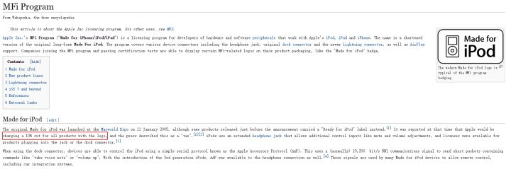

# iPhone取消3.5mm耳机孔背后的IT规律  

两年多前的9月8日凌晨，苹果新一代的智能手机iPhone 7/7 Plus正式发布。尽管它的很多细节都已经在人们的预料之中，但新机的亮相还是引发了激烈的争论。原因大家都知道，那就是手机取消了3.5mm耳机插孔这件事了。  

苹果抛弃这个我们的“老朋友”并不是完全没有理由的，毕竟3.5mm耳机插孔作为一个年代非常久远了的技术，它对机身内部空间的占用是惊人的。虽说这不像Apple Watch那样想塞进去什么新东西都捉襟见肘，但现在的智能手机其体积已经不能再大了，功能还那么多，也一样是寸土寸金。

苹果说，iPhone 7两款新机之所以取消了3.5mm插孔，一方面是为了腾出空间增加更多东西，比如更大的电池容量和更好的相机传感器，另一方面则是要促使用户们尽快进入所谓的“无线时代”。  

***然而，抛开苹果对外界的解释，这一举措的背后暗含着更多的利益考量以及IT规律。***  

Youtube上知名科技频道JerryRigEverything在发布的视频中提到：
>"There are several reasons why Apple removed the headphone jack from the iPhone 7, and surprisingly, Courage is not one of them."
>“苹果取消了iPhone7上的3.5mm耳机接口的理由有很多，但惊人的是，勇气绝对不是其中之一。

以下是我认为苹果背后的动机：

***1.苹果拥有lightening接口的所有权。***  
任何想要生产、销售lightening接口相关产品的公司，都必须向苹果缴纳一笔巨额费用，这就是苹果著名的MFI Program("Made for iPhone/iPod/iPad")，它是苹果的直接收入来源之一。  

  

总的来说，苹果自行设计lightening接口、收取授权费，无可非议。然而，HDMI接口也是登录商标，厂家若想生产销售HDMI线材也需要缴纳版权费，然而，这笔费用大约是……    

  

**另一方面，苹果并非3.5mm接口的设计者，所以任何3.5mm耳机口配件的生产，苹果无法从中获利。**  

所以，3.5mm口被砍掉后，任何能插入iPhone的配件，苹果都能从中获取巨额利润，无论苹果是否参与了设计与生产。  

***2.设计***

发布会中，苹果说它们致力于"Wireless Future"，然而这个理由却十分不正当。  

若苹果真的致力于无线未来，他们就应该在iPhone7加入在许多手机上早已实现了的无线充电功能。归根究底，无线充电并不能给苹果带来利润，苹果要想使用的话，就必须给其他公司支付授权费用。  

***这对于铁公鸡库克来说是不能忍受的。***  

所以，苹果取消3.5mm接口的背后，既有IT发展规律趋势的体现，也有利益的考量。  

所以，失去了乔布斯，由库克带领的的苹果，真的还有那么大的勇气致力于改变世界吗？

