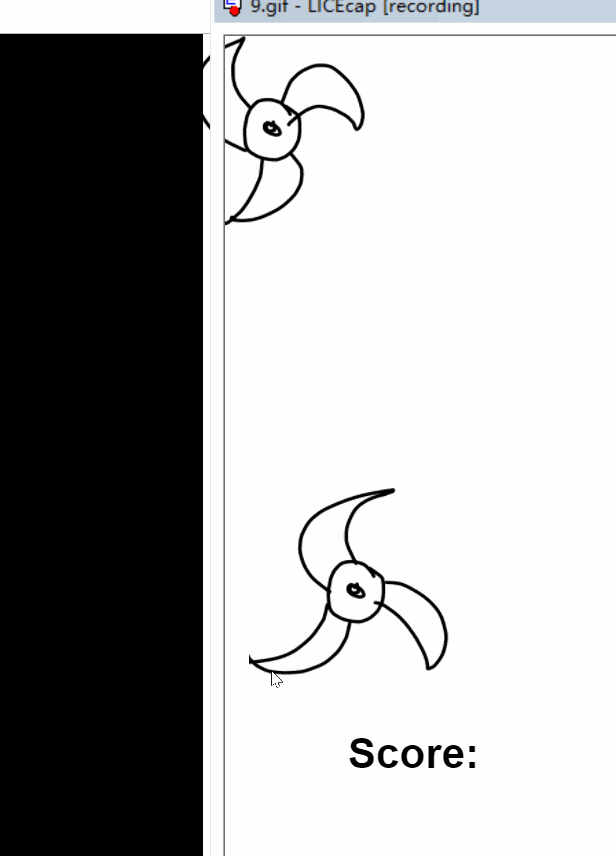
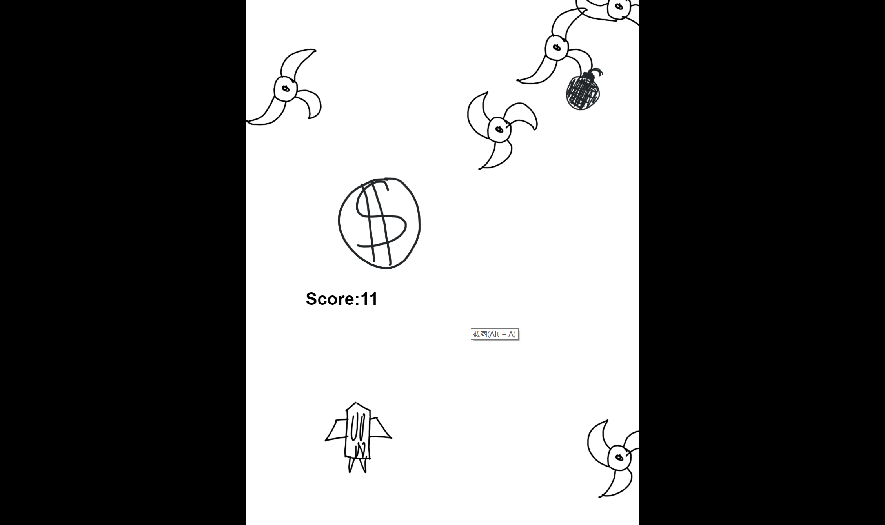
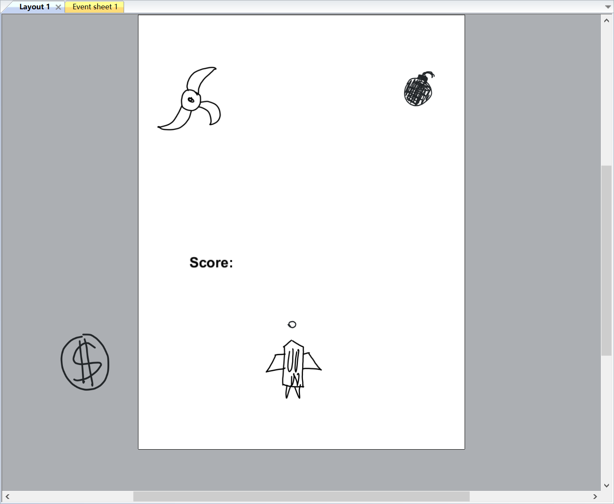
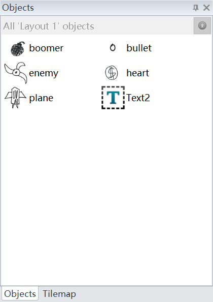
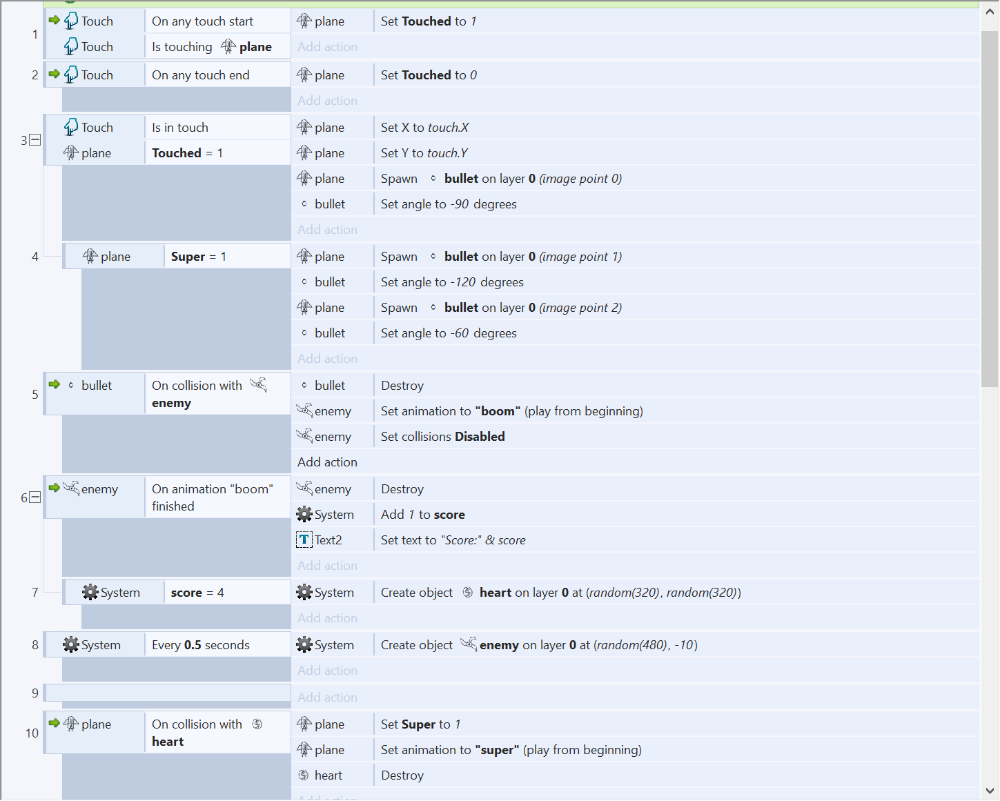
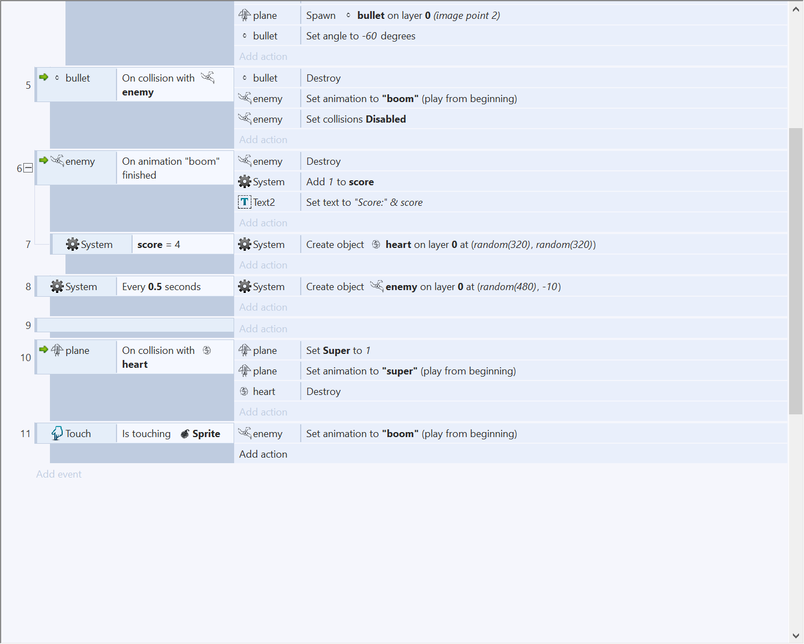

# 飞机大战游戏设计  

  

---

***游戏策划***  

**楔子(Setting)：**  
在天空执行任务的舰队碰到了会旋转跳跃的外星敌人，舰队派出了战斗飞机保卫队伍。

   

**玩法(Gameplay)：**  
玩家用触控操作操控飞机射击敌人，每击杀一个敌人得一分，分数>=4后出现散弹枪触发按钮，点击后飞机后变为可发射散弹。点击右上角的炸弹可清屏，销毁屏幕中的所有敌人。

**人设与道具（Game Sprites）：**  
Player：飞机。可连续发射子弹，触碰到散弹触发开关后变为发射三排子弹。  
Enemy：被子弹击中后爆炸、销毁。  
Boomer：点击后可清除屏幕上所有敌人。  

  

---
***游戏开发小结***  

1. Object:子弹  
Attribute:图片,位置  
Collaborator：精灵   
Events & Actions：碰撞 & 销毁自己  

2. Object:飞机  
Attribute:图片,位置  
Collaborator：精灵     
Events & Actions：发射子弹 & 移动 & 触发散弹开关  

3. Object:敌人  
Attribute:图片,位置  
Collaborator：精灵    
Events & Actions：碰撞到子弹 & 爆炸 & 销毁自己 & 每1.0秒产生一个新敌人  

4. Object:散弹开关  
Attribute:图片,位置  
Collaborator：精灵    
Events & Actions：点击 & 使飞机变为散弹发射  

5. Object:炸弹  
Attribute:图片,位置  
Collaborator：精灵    
Events & Actions：点击 & 清除屏幕中所有敌人  

6. Object:Score  
Attribute:文本框,位置  
Collaborator：文本    
Events & Actions：显示分数（每死去一个敌人，分数+1）  

