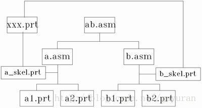

# 洗衣机算法设计    

## ***“自顶向下，逐步求精的方法"*** 

自上而下 在英文中称作Top-down Design，是一种计算机编程使用的算法思想，顾名思义，这种方法的思想就是对现在遇到的复杂或者抽象化的问题，进行纵向深入分解并使其被分解为多个简单的、具体化的、可解决的问题。   

  

在新产品的设计和开发过程中，设计师和工程师都依赖于自下而上和自上而下的方法。当选择现成的或现有的组件并将其集成到产品中时，可以使用自下而上的方法。一个例子包括选择特定的紧固件，例如螺栓，以及设计接收部件，使得紧固件适当地配合。在自上而下的方法中，定制紧固件将被设计成使其适当地适合接收部件。[2] 对于透视图，对于具有更多限制性要求的产品（例如重量，几何形状，安全性，环境等），例如太空服，采用更自上而下的方法，几乎​​所有东西都是定制设计的。然而，当最小化成本和增加部件可用性更重要时，例如制造设备，将采取更自下而上的方法，并且许多现成的部件（螺栓，齿轮，轴承等）将会尽可能选择。在后一种情况下，接收外壳将围绕所选组件设计。  

在软件开发过程中，自上而下和自下而上的方法起着关键作用。

自上而下的方法强调规划和对系统的完整理解。固有的是，在系统的至少某些部分的设计中达到足够的细节水平之前，不能开始编码。通过附加存根来代替模块来实现自上而下的方法。然而，这延迟了对系统的最终功能单元的测试，直到重要的设计完成。自下而上强调编码和早期测试，一旦指定了第一个模块就可以开始。然而，这种方法存在这样的风险：模块可能被编码而不清楚它们如何链接到系统的其他部分，并且这种链接可能不像最初想象的那么容易。代码的可重用性是自下而上方法的主要优点之一。[3]

自上而下是一种编程风格，是传统程序语言的主流，其中设计从指定复杂的部分开始，然后将它们分成连续的小部分。使用自上而下方法编写程序的技术是编写一个主程序，命名它将需要的所有主要功能。之后，编程团队会查看每个功能的要求，并重复该过程。这些划分的子程序最终将执行如此简单的动作，它们可以轻松简洁地编码。当所有各种子程序都被编码后，程序就可以进行测试了。通过定义应用程序如何在高层次上聚集在一起，较低级别的工作可以是自包含的。通过定义低级抽象如何被整合到更高级别的抽象中. 

## ***洗衣机程序设计***

注水--水位达到需要的高度后停止注水--启动并开始计时、转动--到时后停止--排水--停机

**注水：**  
water_in_switch(open） // open 打开上水开关，close关闭 

**水位达到需要的高度后停止注水：**  
SET terminal height to the value of the height to stop    
get_water_volume()   
IF get_water_volume() >= terminal height  //返回洗衣机内部水的高度
water_in_switch(close) 

**启动并开始计时、转动：**  
motor_run(direction) // 电机转动。left左转，right右转，stop停
time_counter() // 返回当前时间计数，以秒为单位  

**到时后停止：**   
motor_run(stop)  

**排水：**  
water_out_switch(open) // open 打开排水开关，close关闭
water_out_switch(close) // open 打开排水开关，close关闭  

**停机：**  
halt(returncode) //停机，success 成功 failure 失败 