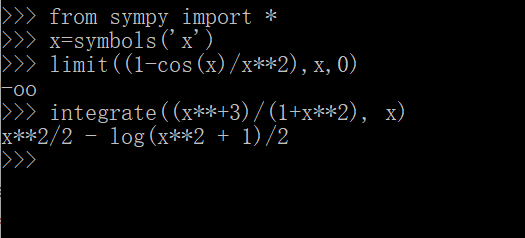
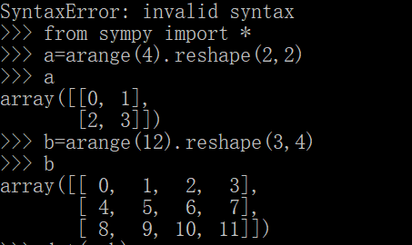
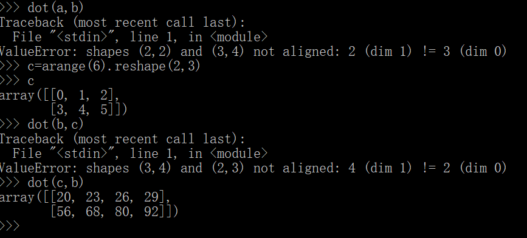
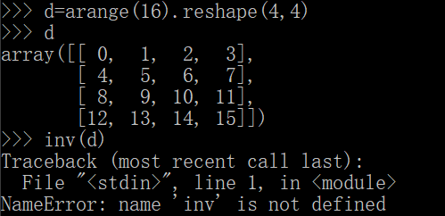
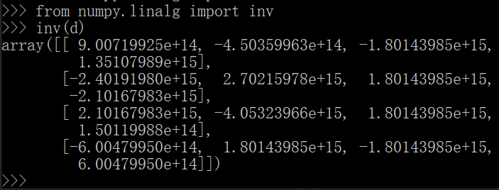

# python 编程设计报告

## "Life is short, choose Python!"

**这里简单介绍如何使用 python的两个库 sympy 与 numpy 解决高数与线性代数问题。**

# Sympy

首先调用sympy库
```
from sympy import*
```

**求极限语法**  

```
limit((表达式)，x，趋于的值) 
```

**求不定积分语法**
  
```
integrate((表达式)，x)
```

  

# Numpy  

首先调用numpy库

```
from numpy import*
```  

然后创建矩阵，利用arange函数快速排列各个元素的值，然后利用reshape函数定义矩阵的行数和列数。注意arange的元素个数要与行数和列数匹配，否则会报错。  

 

**矩阵乘法语法**

```
dot((matrix a),(matrix b))
```

注意矩阵a的列数要等于矩阵b的行数，否则会报错。

  

**求矩阵的逆语法** 
```
from numpy.linalg import inv  
inv(matrix)
```  
注意若开头不调用inv，会报错。  

  

