# 互联网伦理道德问题与隐私风险

## *李彦宏：“中国人更开放，对隐私问题没那么敏感。”*  

互联网隐私泄露问题虽已是老生常谈，但近日，随着国内某BAT大佬对于“中国人隐私观”的言论的一石激起千层浪，以及Facebook的隐私泄露门，这个问题再次进入人们的视野。  

## *我们生活在楚门的世界中吗？*

的确，今时今日，互联网隐私的泄露问题已十分严峻，特别是进入到了大数据时代后，各家互联网厂商八仙过海各显神通。而令人心寒的的是，一家家表面如此光鲜的企业，背后竟有如此的吃相，甚至是各家大厂，也逃不过搜集、泄露用户隐私的指控。  

## **那么，这些隐私是通过什么途径泄露出去的呢？**  

1.用浏览器搜索东西，会产生cookie、搜索记录等数据，这些数据都会被存放在一个目录中。  
2.app拥有众多存储器读写的权限，而用户通常不会去仔细阅读隐私须知甚至是对这些权限可能存在的风险一无所知，当然，更不用说app没有声明而偷偷调用权限的吃相了。若互联网公司有心去获取，便可获得大量的用户信息。  
3.在今时今日的大数据时代，这些数据是互联网公司的宝贝，一旦查到这些数据，上传到服务器做大数据分析，便可形成一张精准的网络，描绘出你的个人信息、住址、电话、喜好、需求等等，然后精确投放广告或是出售给其他组织，从而获取暴利。  
4.手机厂商也会收集用户数据，特别是安卓平台的隐私问题，可谓格外严重。区别只是，大厂的吃相稍微好看一点。  

> ### 因此，我们可以说，用户的隐私不仅正在被监视，而且是被全方位监视。  

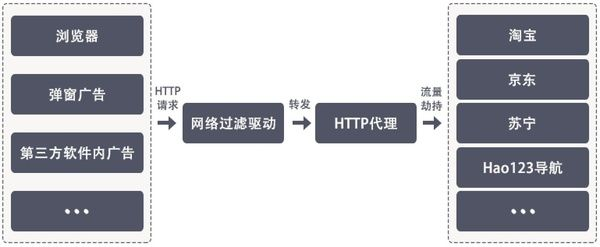

## **这些对隐私的拿取究竟体现在哪？Let’s see！**   

## 1.淘宝  

作为国内最大的电商平台，淘宝曾被网友多次指出会在启用时调取摄像头、麦克风的权限，以达到收集用户行为、话语，分析用户的潜在购物需求，从而精准投放广告、推荐的目的。  

以下为阿里系app调用摄像头、麦克风权限的证据：  

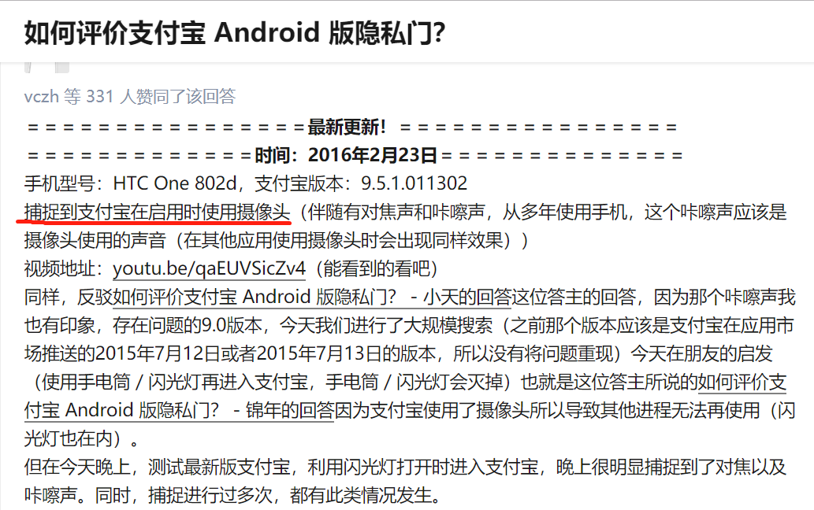  

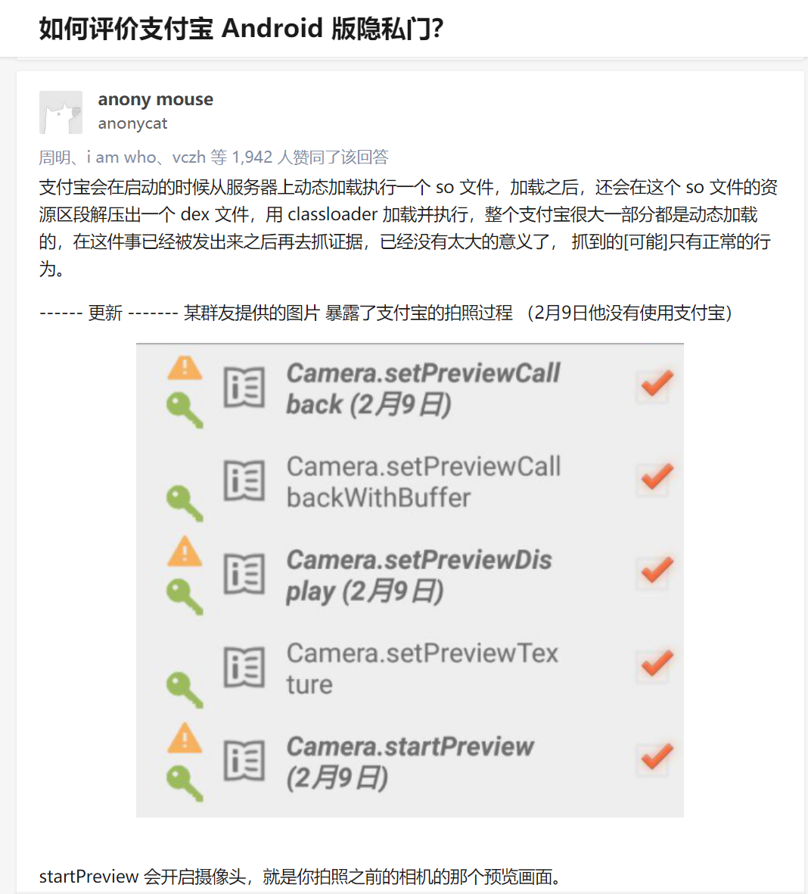  

**而也有许多网友察觉到了这一事实：**

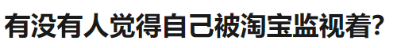  

广告的精准投放：

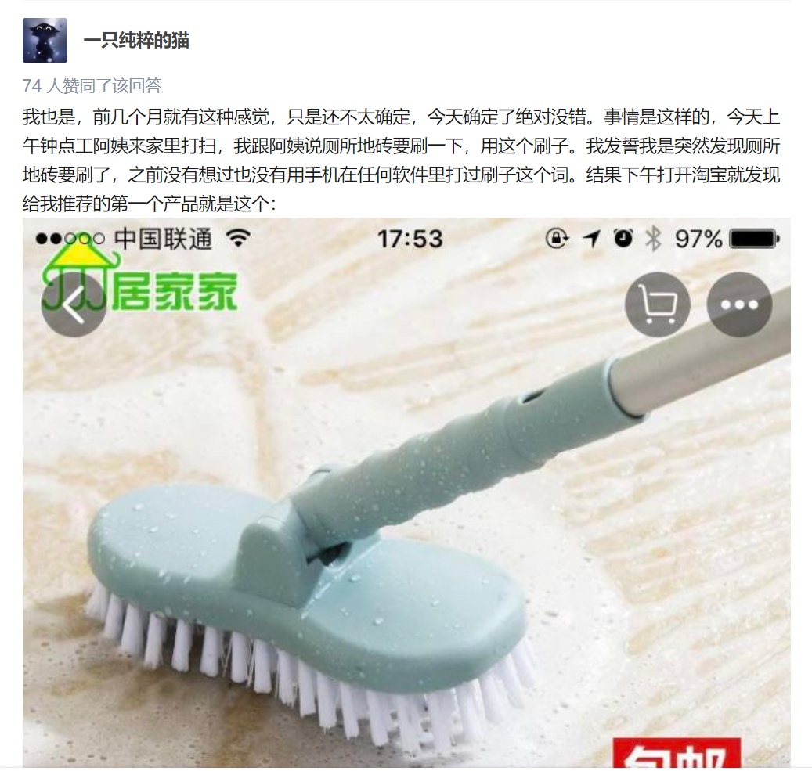  

同时，来自同一家公司的UC以及淘宝，也会在后台“共享”用户信息。

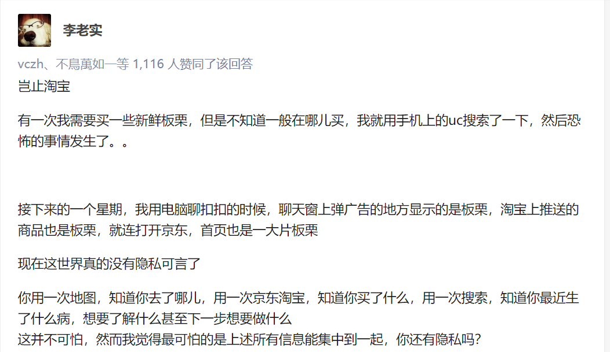

## 2.百度  
百度的竞价排名已不是新鲜事，莆田医院导致的无辜青年失去生命的悲剧仍笼罩在人心，而它与各隐私收集行业的相互勾搭却未曾停息。  

一方面是擅自收集用户搜索偏好，以达到精准推送竞价排行广告的目的。   
另一方面是将用户搜索行为，甚至是注册时填写的个人信息，售卖给其他的诈骗公司，获取暴利。  

让我们来看一看这位网友的经历：  

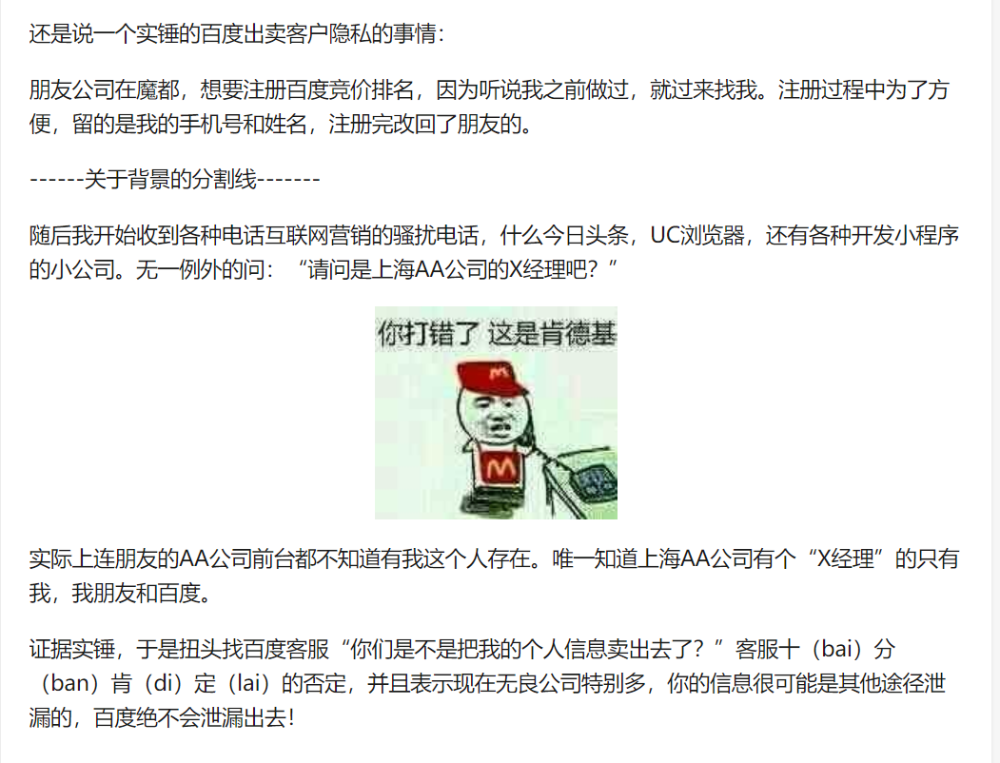  

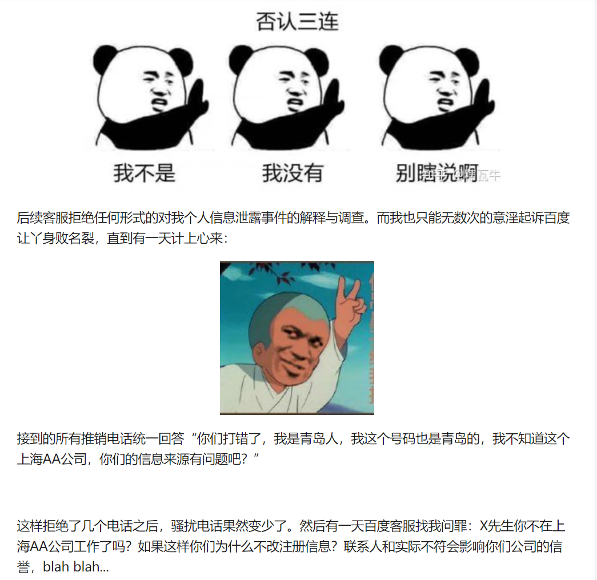  

**“售卖个人信息的企业谈个人信誉恐怕并不能有说服力吧。”**    

当然还有，老生常谈的虚假广告插入。

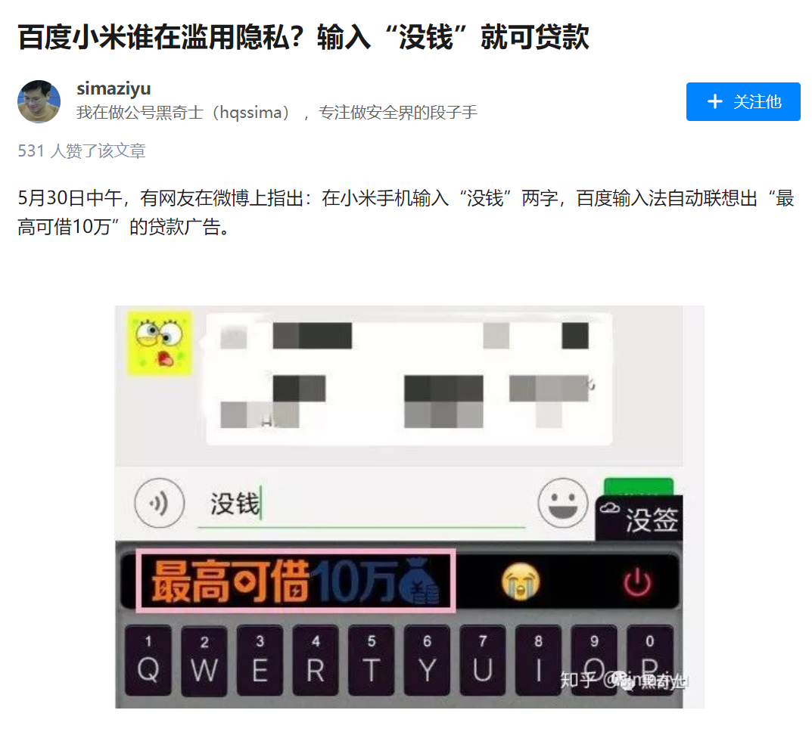  

## 3.APP权限  

App拿权限已经是家常便饭，无论是什么浏览器App、天气App、聊天App，不拿你几十个权限都不好意思，这一点，在对权限更为开放的安卓系统上更明显，也更高危。

日前，被cctv点名批评的wifi万能钥匙，曾是许多人手机里必备的一款软件。 

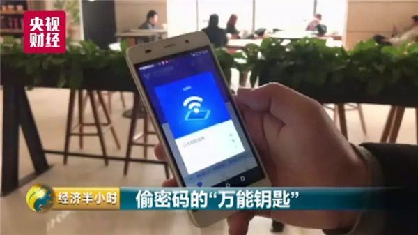

这类App之所以能成功偷到他人的网络密码，所依靠的必然是庞大的WiFi密码数据库。  
而这数据库之中，有多少用户不知情下泄漏出去的隐私？这数据库，又是如何获得的？这是非常值得担忧的。只要是来你家的其中一位朋友，不小心点了一下“共享密码”，你的隐私就会被暴露在众人眼前。  
毕竟谁也不敢保证，所有的WiFi分享类App都会严格把关WiFi密码分享的过程。万一被侵入路由器盗取信息，也不会令人吃惊。

---

同样，针对安卓日益严格把控的权限，各类app也自有对策。  

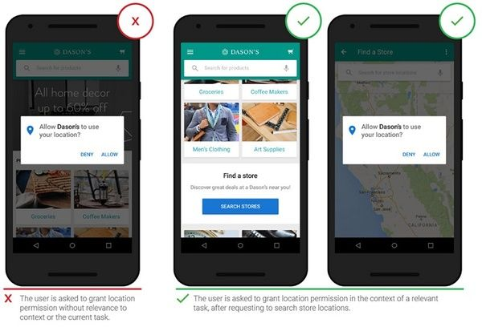  

你虽然可以拒绝你安装的app打开某一个权限，但一旦你拒绝后，这个软件可能就直接拒绝你打开它了，这样的行为，是在“绑架”着你接受它的权限申请，从而达到该企业获利的目的。  

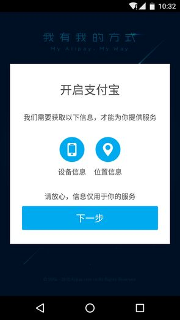

---
## 结束语：  

连互联网大佬马克扎克伯格都尚且害怕自己的隐私被泄露，那么我们普通人呢？  

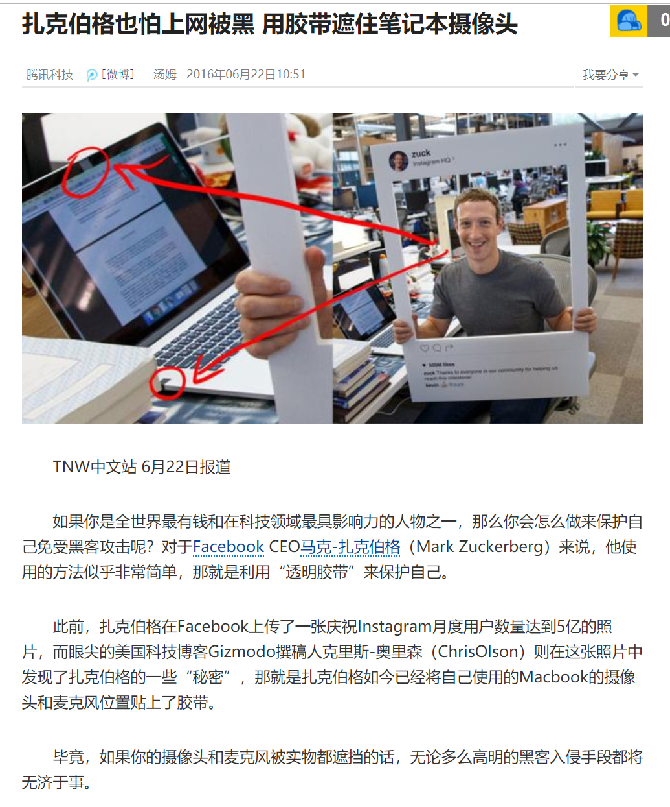  

### 不少人开玩笑说，生活在大数据时代，感觉自己就是楚门。

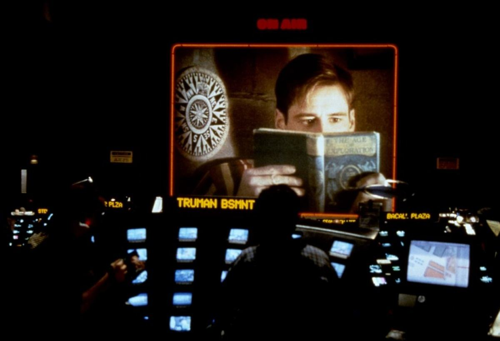  

>的确，从刚进入互联网时代时的人肉，艳照门，到现如今iMessage里莫名其妙的骚扰广告、理财贷款的骚扰电话， 被利用的搜索记录……谁说现在不是楚门的世界呢？

>只不过，这个世界里，人人都是楚门。

>这是最讲究隐私的时代，也是最没有隐私的时代。

>***谁来监控，那些监控者们？***

