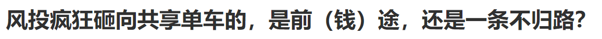
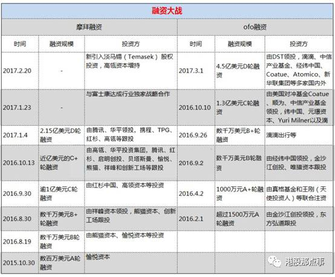
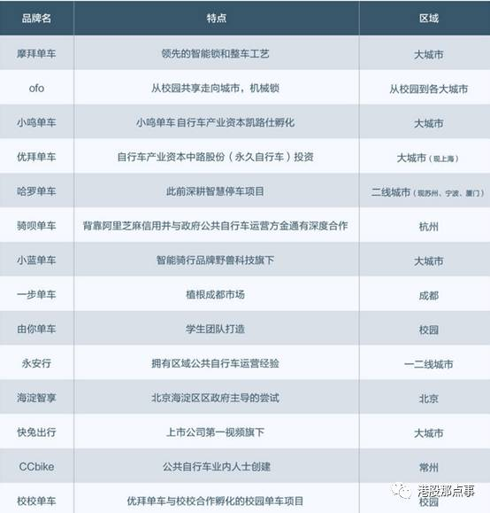
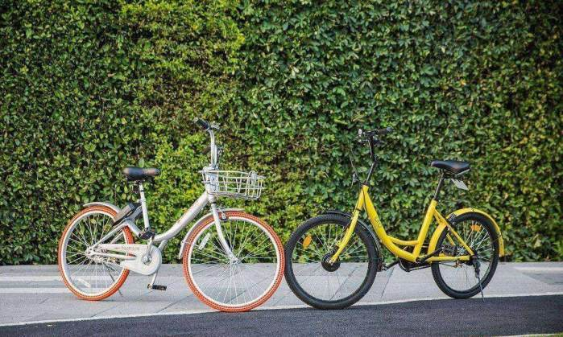
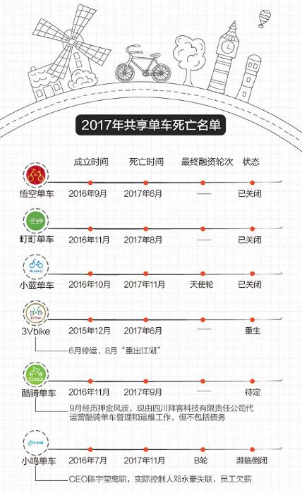
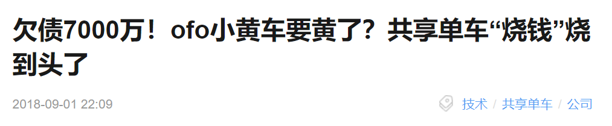

# IT风投之我见  

在中国，风投向来更青睐互联网企业。  

  
 
而最近沸沸扬扬的ofo面临倒闭，人去楼空的事件，刚让我们重新审视IT界风险投资市场。  

## 共享单车背后的中国风投之殇  

>“崩溃的盈利模式，资本推动下过于激进的业务铺张，共享单车已经失去了独立发展的可能，两家龙头同时存在的前提都已经失去，要么合并，停止争斗，要么一家倒下。合并难以有进展，内耗的结果是，加速了其中一家的倒下。”  

共享单车这场大戏进行到下半场，风投、创业公司、互联网巨头、政府已经悉数登场。  
 

从军阀混战的彩虹大战，到两国对峙的橙黄之争，再发展到如今伴随着农村包围城市的形势，哈罗单车崛起，共享单车在近一年的野蛮生长，速度之快，牵涉的问题之多让人瞠目。

这场大战中，ofo和摩拜创始人，两家公司的背后的风险投资方：滴滴与腾讯还有阿里，他们的行动就很大程度决定了未来的走向，而他们的行动源自于他们的利益需求。

就在这样的各个利益交织下，合并才变得如此错综复杂，困难重重。

既然合并渺茫，那么，倒闭这一个悲剧结局，要不落在ofo上，要不落在摩拜身上，至于是谁，**就要看时间和运气站在哪一边。**  

一个不争的事实是，共享单车的盈利模式已经崩溃。主要原因有：低估了运营成本以及车辆损毁率，无法做到降低车辆维修及人员调度成本。 

共享单车对于公共资源的占有催生了政策出台，大城市自行车已经饱和，双方的市场份额非常接近，现在再去拼价格战、拼资本的融资都没有意义了。只要两个公司耗着，就会产生财务黑洞，火速烧光投资人的钱。  

　除此之外，共享单车的终局，已经演变为互联网巨头市场布局的争夺战，而在这场战争中，腾讯支持摩拜，阿里支持哈罗，滴滴自营，ofo则陷入僵局。

> 而近日，一位接近ofo内部人士对腾讯《一线》透露，从本周开始，ofo公司账户上的可用资金仅剩下不到6亿人民币，若按照ofo每月4-5亿元的人员工资和运维等支出、以及持续流出的押金计算，ofo手上的现金仅能支撑一个月。该人士还称，每月10日是ofo公司发薪日，1月10日当天，ofo在为员工和兼职劳务工人发完工资后，账目上的现金仅剩下不到6亿人民币。与之相对应的是，ofo至今仍欠供应商约25亿元人民币，亏空押金总额约30亿。

 

### 看来，在这一轮混战中，三振出局的是ofo。